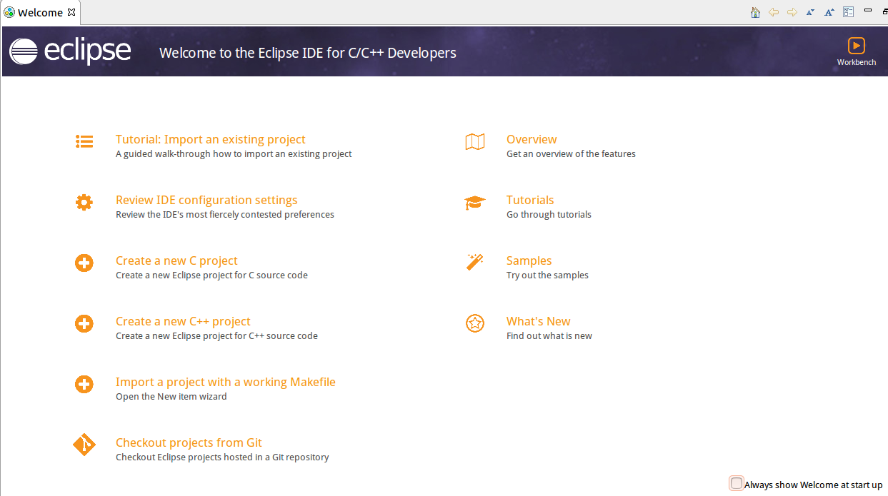
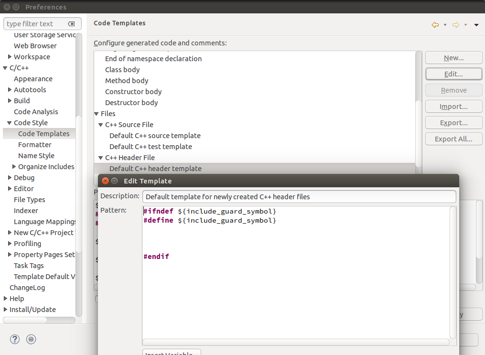
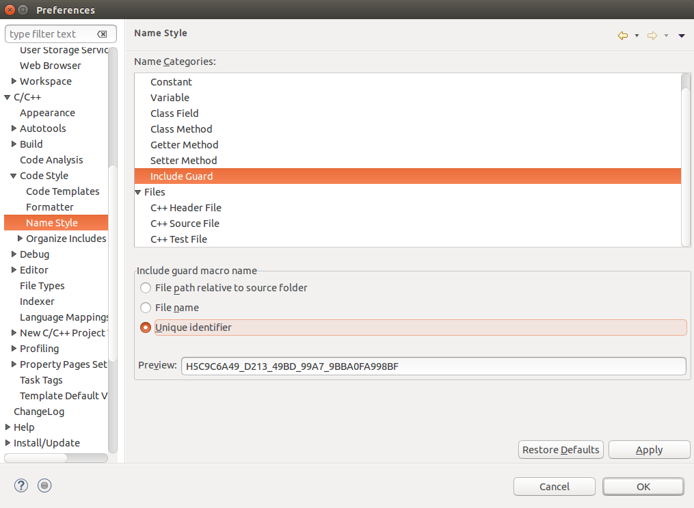
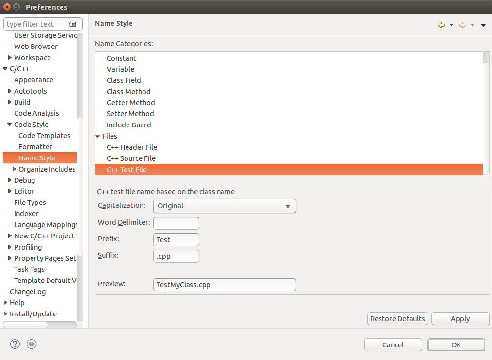
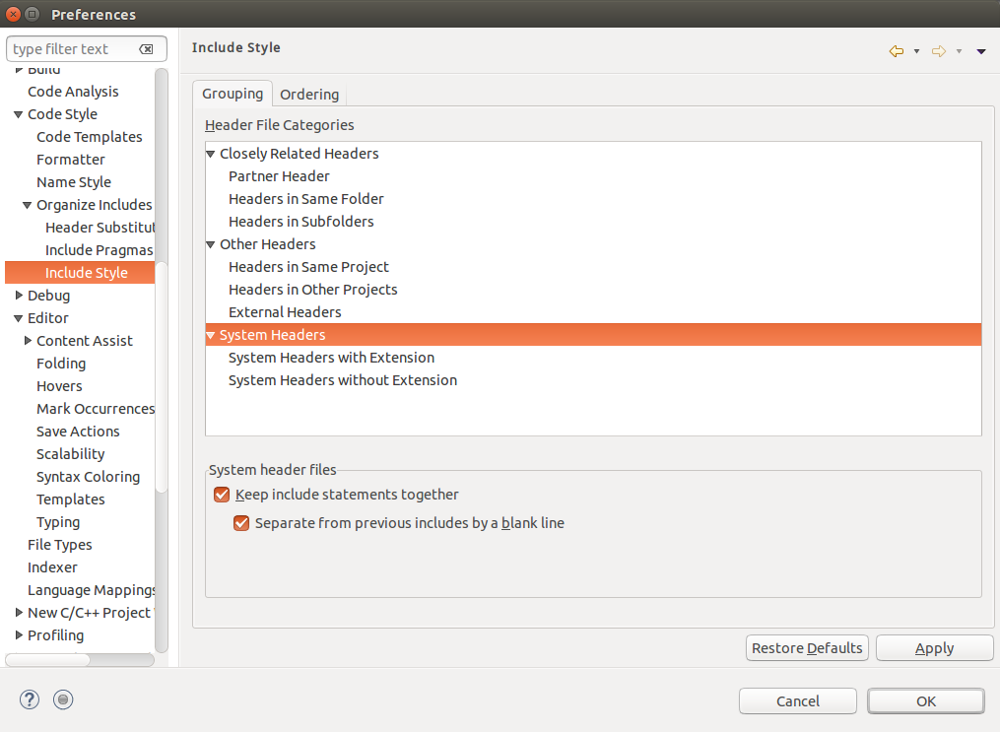
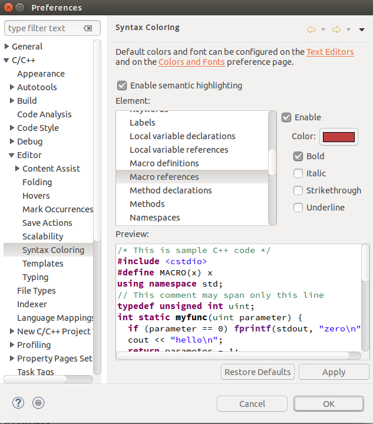

# Effective Eclipse CDT

***

本文中用eclipse代指eclipse CDT。

本文内容基于当前最新的eclipse neon版本， 请于[eclipse官网](http://www.eclipse.org/downloads/eclipse-packages/)下载，并持续跟踪eclipse最新版本。

## Install

由于windows和mac系统上的安装相对简单，下面的安装过程基于linux系统。我个人在ubuntu14.04下经过测试。

Eclipse安装之前需要先安装[JDK](http://www.oracle.com/technetwork/java/javase/downloads/index.html)。

### Install JDK

- Download JDK

```bash
http://www.oracle.com/technetwork/java/javase/downloads/index.html
```

- Install JDK

```bash
sudo mkdir -p /usr/local/lib/java
sudo tar zxvf jdk-8u91-linux-x64.tar.gz -C /usr/local/lib/java
cd /usr/local/lib/java && sudo ln -s jdk1.8.0_91 default
```

- Export `JAVA_HOME` and `PATH`

```bash
echo "export JAVA_HOME=/usr/local/lib/java/default" >> ~/.bashrc
echo "export PATH=$JAVA_HOME/bin:$PATH" >> ~/.bashrc
source ~/.bashrc
```

- Verify

```bash
$ java -version
```

### Install Eclipse

- Download eclipse

```bash
http://www.eclipse.org/downloads/packages/eclipse-ide-cc-developers/neonr
```

- Install eclipse

```bash
sudo mkdir -p /usr/local/eclipse
sudo tar zxvf eclipse-cpp-neon-R-linux-gtk-x86_64.tar.gz -C /usr/local/eclipse
cd /usr/local/eclipse && sudo ln -s eclipse default
```

- Add eclipse to `PATH`

```bash
echo "export ECLIPSE_HOME=/usr/local/eclipse/default" >> ~/.bashrc
echo "export PATH=$ECLIPSE_HOME:$PATH" >> ~/.bashrc
source ~/.bashrc
```

- Verify

```bash
eclipse &
```

## Global Config

初次打开eclipse，如下图。勾掉右下角的`Always show Welcome at start up`，然后点击右上角的`Workbench`图标进入主界面。



点击菜单栏 `Window -> Preferences`，在里面进行eclipse的全局配置。

### 设置字体

有美感的程序员装好IDE后的第一要事肯定是先配置一个好字体。编码最好使用等宽字体，如果你是在mac系统上，那么默认的字体就很不错；而Ubuntu下自带的”Ubuntu Mono“也很漂亮；Windows上自带的等宽字体"Courier"则有些中规中矩。更换字体时看到名字里面带有`mono`的基本都是等宽字体。

如果想选跨平台的第三方字体，值得推荐的有”Inconsolata“，”Consolas“和”Source Code Pro“。这些字体系统没有自带，需要自行安装。

本文推荐”Source Code Pro“，它是Adobe发布的一款面向程序员的非常漂亮的开源字体集，可以在[github](https://github.com/adobe-fonts/source-code-pro)下载。

#### 安装字体

- Windows系统：
> 将下载下来的”source-code-pro/ttf“目录里的字体文件拷贝到系统盘下”windows/fonts“目录下即可完成安装；

- Linux系统：
> 在个人主目录下建立`.fonts`目录，将下载下来的”source-code-pro/ttf“里面的字体文件拷贝进去即可；

- Mac系统：
> 打开 ”Finder -> 应用程序 -> 字体册“； 添加下载下来的”source-code-pro“目录，即可完成安装；

安装好字体后，重启eclipse。

#### 修改字体

- ** Window -> Preferences -> General -> Appearance -> Colors and Fonts -> C/C\++ -> Editor -> C/C\++ Editor Text Font **

点击Edit，选择自己喜欢的字体；字号一般设置为10或者11比较合适；


### 修改快捷键

- ** Window -> Preferences -> General -> Keys **

在上面位置进行快捷键设置，我一般直接使用eclipse默认的。

在ubuntu下，eclipse常用的复制行的快捷键`Ctrl + Alt + Down`和系统默认的切换工作区的快捷键冲突了。由于我一般不用ubuntu的扩展工作区，所以我会把ubuntu自身的快捷键进行修改。具体在 `系统设置 -> 键盘 -> 快捷键 -> 导航 -> 切换至上侧工作区` 以及 `切换至下侧工作区`，将这两个快捷键删除，或者改成别的。

### 设置代码风格

代码风格是一个仁者见仁的事情，下文的所有配置都是我比较喜欢的风格，你可以根据自己的口味进行调整。

- ** Window -> Preferences -> General -> Editors -> Text Editors **

将`Displayed tab witdth`设为4； 勾选上`Insert spaces for tabs` 以及 `Show line number`。

- ** Window -> Preferences -> C/C++ -> Code Style -> Code Templates **

在这里配置各种默认代码模板，包含文件头注释模板、函数头注释模板、以及各种文件模板。例如我一般会在这里对C++默认的头文件模板进行修改，去掉文件头注释，去掉文件结尾对”include guard“的重复注释等等。



在这里可以点击`Export`将自己配置好的Code Templates导出去，以便备份和共享。

- ** Window -> Preferences -> C/C++ -> Code Style -> Formatter **

在这里设置默认的代码格式化风格。由于我个人喜欢大括号单独一行对齐，所以一般基于eclipse自带的`BSD/Allman`模板进行修改。


如上图，在Active profile中选择BSD/Allman后，点击Edit进行修改。我一般的修改如下：

    - Indentation:
        - Tab policy : 改为 ”Spaces only“
        - Statements within switch body ： 打上勾
        - Declarations within namespace definition： 打上勾
        - Empty lines ： 打上勾
	- Braces:
		- Initializer list ： 改为 ”Same line“
	- New Lines:
		- before colon in constructor initialzer list : 打上勾
	- Control Statements:
		- Insert new line before catch in a try statement : 打上勾
		- Keep simple if on one line : 打上勾
	- Line Wrapping:
		- Function declarations -> Constructor initializer list :
			- Default indentation for wrapped lines : 设为0
			- Default indentation for initializer lists ： 设为0

最后对设置好的code formatter起个新名字。可以在这里点击`Export`将配置好的formatter导出去，以便备份和共享。

- ** Window -> Preferences -> C/C++ -> Code Style -> Name Style **

在 `Code -> Include Guard`里面，将`Include guard macro name`设置为`Unique identifier`；



这样eclipse自动生成的头文件模板里面，头文件的include guard默认为一个随机的全局唯一UUID，这样设置的原因是当你重命名头文件或者修改头文件路径后，不用再去手动修改头文件的include guard，避免include guard不小心重名导致的难以定位的编译问题。

另外在当前页面下，可以配置C\++头文件名、源文件名以及测试文件名之间的规则关系，见下图。在开发的过程中遵守这里配置的文件命名规范，会有很多好处。首先eclipse靠这里的文件命名规则关联类的头文件和实现文件。当你的类名、头文件名、实现文件名和测试文件名按照上图中的配置规则保持一致，重命名类名后，eclipse会自动关联修改头文件名，实现文件名和测试文件名以及所有对头文件的include路径名。



这里我一般会将 `Files -> C\++ Test File` 中 `Prefix`设置为"Test"， `Suffix`设置为".cpp"，让测试文件名称保持 ”Test*.cpp“。

- ** Window -> Preferences -> C/C++ -> Code Style -> Organize Includes **

该栏目下设置和头文件包含相关的选项。Eclipse默认对自动添加的头文件按照设置的规则进行排序。如果不想要自动排序，那么就勾选掉 `Allow reordering of includes`。

在 `Organize Includes -> Include Style`中可以设置头文件包含规则和顺序。

在 `Grouping`标签页里面，我一般会设置所有的头文件类型以尖括号包含（将`Use angle brackets`打钩）。另外，设置系统头文件和前面所有的空一行（选择`System Header`，将`Separate from previous includes by a blank line`打钩）；



在 `Ordering`标签页中，我会调整头文件的包含顺序，将系统文件放在最后，如下图：


- ** Window -> Preferences -> C/C++ -> Editor -> Syntax Coloring **

该标签下可以设置语法配色方案。我一般只改一点，就是宏引用的颜色。因为宏一般被我作为语法糖来来用，所以希望其色彩和关键字比较像（偏暗红，类似关键字，但有所区别）。修改如下：

在 `Code -> Macro references` 下，将`Enable`和`Bold`打钩，然后点击`Color`，将颜色调为`#BF4040`。



### Others

- ** Window -> Preferences -> C/C++ -> Editor -> Scalability **

在该标签里面可以设置eclipse解析文件规模的一些选项。最关键的一个是`Enable scalability mode when the number of lines in the file is more than`用来设置默认最大完全解析的文件行数，默认是5000。对超过5000行的文件eclipse为了避免消耗资源过多将会只进行部分解析，至于解析哪些，可以在下面进行设置。在eclipse下开发，不建议产生大文件。如果是阅读遗留代码，可以根据自己系统资源能力将5000改的更大。

- ** Window -> Preferences -> C/C++ -> Editor -> Templates **

在这里New一种新的代码template，取名cn，Pattern设为`${file_base}::`。这样当你类名（假如MyClass）和文件名（MyClass.cpp）相同的时候，你在文件内敲cn会自动补全为`MyClass::`。这样在实现文件内写类的成员函数实现时会比较方便。


这里还可以配置其它代码块模板，配置好后可以点`Export`将其导出。

- ** Window -> Preferences -> C/C++ -> File Types **

这里可以增加新的文件类型。我一般会用`*.tcc`类型的文件做模板的实现，所以在这里增加新的文件类型。点击New，创建新的文件类型`*.tcc`，Type设为`C\++ Header File`。


- ** Window -> Preferences -> General -> Workspace **

关于workspace的设置，有两个可以关注。一个是设置eclipse构建前自动保存所有文件`Save automatically before build`；另一个是当代码注释中出现中文乱码时，尝试修改最底下的 `Text file encoding`，将其改为`GBK`。建议最好还是不要用中文注释的好，避免编码不一致带来的乱码问题。

- ** 导出配置 **

前面介绍的Code Templates, Code Formatter, Editor Templates需要单独导出成xml文件！

其余的主要配置，可以通过 `File -> Export -> General -> Preferences` 进行导出。勾选你要导出的选项，然后将其导出为一个epf文件。

关于前面介绍的Code Formatter和全局配置我已经导出了，上传在[github](https://github.com/MagicBowen/eclipse-config)。

其中global-config.epf是全局配置，选择 `File -> Import -> General -> Preferences` 将其导入eclipse。

code-formatter.xml是formatter的模板，在`Window -> Preferences -> C/C++ -> Code Style -> Formatter`中点击`Import`将其导入。

## Project Config

由于全局配置直接在工程配置中生效，所以关于代码风格之类的配置在工程属性里面一般不用改。工程配置主要关注于工程代码的构建选项。只要配置好了构建参数，工程代码就能够被正常解析，当然也可以用eclipse直接构建（对于我个人，更加喜欢用命令行构建，eclipse工程进行构建配置主要是为了能够正确解析代码）。

### 新建工程

### 导入工程

### 配置工程

### 导出工程配置

-- new project -- import project -- project name -- include path -- c++11 support -- outer compile

## Effective Usage

-- open file -- find resource -- find reference -- method invoke -- jump to defination -- ctrl + H -- new folder / file -- class inheritance -- function override -- rename class -- rename file/ move folder -- add include -- copy line ， move line -- comment -- recent files -- switch view -- format code -- rebuild index -- macro spread -- alt + shift + a --ctrl+m alt+？

## Others

- 中文支持
- 自动导出、导入配置